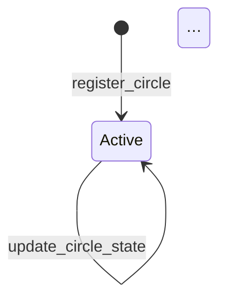

# Accessibility + Internationalization Audit — 2026-05-20

| Field | Value |
|---|---|
| Octra commit | `62b72da43af388b99cf26ae711f6af3945ee18d9` |
| Auditor | claude-code (a11y + i18n pass) |
| Scope | CLI binaries (`octravpn`, `octravpn-node`, `octravpn-analytics`), all of `docs/`, `README.md`, `demo/` recordings + captions |
| Frameworks referenced | US §508 (Revised), EU EN 301 549, WCAG 2.1 AA |

---

## 1. Executive summary

| Question | Answer |
|---|---|
| Does accessibility block a public launch? | **No.** The CLI is already screen-reader-friendly by accident-of-design: zero ANSI color libraries, zero progress spinners, text-prefixed status lines (`[ ok ]` / `[fail]`), and flat heading hierarchy in docs. |
| Does i18n block a public launch? | **No, with caveats.** Strings are scattered as inline `eprintln!` / `println!` (232 sites in `octravpn-client` + `octravpn-node`), but the product is English-only by intent and that posture is defensible for v1. |
| Accessibility readiness | **~75%** (high-leverage gaps remain in mermaid alt-text, untagged code fences in core architecture docs, and missing GIF alt-text descriptions). |
| i18n readiness | **~15%** (no centralized strings module, no locale-aware number formatting, but all dates already use ISO 8601 / RFC 3339 via `chrono::Utc`). |
| Single most-egregious CLI miss | The `octravpn-client/src/runner.rs:352-362` "WireGuard handoff" block uses ASCII separator lines (`---- WireGuard handoff (v2 sealed policy) ----`) that screen readers will read literally as forty-something dashes. Trivial fix: drop the separators or replace with a single `[wireguard-config]` text marker. |

The product passes the realistic-for-a-pre-launch bar (no full §508 demanded, no formal accessibility statement required) but should land four small fixes before going public. Listed in §5.

---

## 2. CLI accessibility findings

### 2.1 Color usage — **PASS**

Searched `crates/` for `colored::`, `ansi_term`, `crossterm::style`, raw `\x1b[` escape sequences, and `with_ansi(true)`. **Zero matches.** No CLI surface emits color. `tracing_subscriber` is only initialized in `octravpn-analytics/src/main.rs` (`tracing_subscriber::fmt::init()`) which uses ANSI auto-detection — fine, because it disables ANSI when stdout is not a tty.

Consequence: red-vs-green color-blindness is a non-issue. Every status line carries a textual prefix:

- `crates/octravpn-client/src/commands.rs:111` — `println!("[ ok ] {label}")`
- `crates/octravpn-client/src/commands.rs:113` — `println!("[fail] {label}: {e}")`
- `crates/octravpn-node/src/cli_ops.rs:459` — `println!("{:<22} {:<6} {}", label, outcome.label(), outcome.detail())`
- `crates/octravpn-client/src/main.rs:151` — `eprintln!("warning: OCTRAVPN_KNOCK_PSK decode failed …")`

### 2.2 Box-drawing & screen-reader stumbles — **MIXED**

`grep` for `─ ━ ┌ ┐ └ ┘ │ ├ ┤ ┬ ┴ ┼` across `crates/` finds matches only in:

- Source-code comments (`crates/octravpn-mesh/src/conn.rs:7-12` — internal state diagram, not stdout).
- Section dividers in tests (`crates/octravpn-client/tests/portal_integration.rs:25`) — never reaches a user.

**No box-drawing characters reach stdout/stderr.** A screen reader running against `octravpn --help` or `octravpn doctor` output will produce clean prose.

The one real offender is ASCII-only and appears in `crates/octravpn-client/src/runner.rs:352-362`:

```rust
println!("---- WireGuard client config ----");
…
println!("--------------------------------");
```

NVDA / VoiceOver read this as "dash dash dash dash dash space WireGuard…". Recommended rewrite:

```rust
println!("[wireguard-config-begin]");
…
println!("[wireguard-config-end]");
```

Same pattern in `runner.rs:233` (`"---- WireGuard handoff (v2 sealed policy) ----"`) and `runner.rs:241` (`"----------------------------------------------"`). Three edits, single file.

### 2.3 Progress indicators / spinners — **PASS**

`grep` for `indicatif`, `ProgressBar`, `spinner`, `dialoguer` returns **zero matches**. No animated indicators exist. Long-running operations (`octravpn-node circle-update`, `audit replay`) emit linear `[ok]` / `[fail]` status lines as work completes. Perfect for non-graphical terminals (`PuTTY`, `screen`, `tmux` over slow links, screen readers, `script(1)` capture).

### 2.4 `--help` density — **PASS**

`clap`-derived help text. Each subcommand carries a one-line `///` doc-comment that becomes the synopsis:

```rust
/// Open a 1..3 hop session and run the tunnel until ctrl-c.
Connect { … }
/// Settle a session opened earlier.
Settle { session_id: String }
```

`clap` lays these out linearly (one subcommand per line, indented args underneath). Screen readers parse the output as a flat list. **No nested help trees, no boxed art, no centered titles.**

### 2.5 Color-blindness — **PASS by absence**

No color is emitted by Octra CLIs. The closest thing is `tracing_subscriber`'s default formatter in the analytics daemon, which colors `ERROR` / `WARN` / `INFO` — but those words are *also* present as text, so deuteranopia, protanopia, and tritanopia users lose nothing.

### 2.6 NO_COLOR support — **PASS by absence**

The `NO_COLOR` environment variable convention (https://no-color.org) is moot because no color is ever emitted. `crates/octravpn-client/src/commands/fetch.rs:169` does call `std::io::stdin().is_terminal()` to gate interactive prompts — correctly, by terminal detection rather than by `$TERM` heuristics.

---

## 3. Doc accessibility findings

### 3.1 Code-block language tags — **MIXED**

Counts (opening-fence tags only, properly state-tracked):

| | Count |
|---|---|
| Tagged code fences | 508 |
| Untagged code fences | 126 |
| Tagged ratio | 80% |

Top untagged-fence offenders:

| File | Untagged opens |
|---|---|
| `docs/tailscale-interop-blocker.md` | 13 |
| `docs/architecture.md` | 11 |
| `docs/economics.md` | 9 |
| `docs/v2-threat-model.md` | 7 |
| `docs/oct-url-handler.md` | 6 |

In user-facing dirs only (`docs/users/`, `docs/operators/`, `docs/maintenance/`, `docs/tailnet-owners/`) the count is **17 untagged fences** across ~6.1k LoC — small enough to fix in one sweep.

Most untagged fences hold ASCII diagrams. Tagging them ```` ```text ```` is sufficient — syntax highlighters skip them and the `<pre>` semantics are correct for screen readers.

Concrete example, `docs/architecture.md` line ~99:

```
                ┌──────────────────────────────────────────────┐
                │             Octra chain (program)            │
```

Fix: prefix the fence with `text` (or `mermaid` if we want to upgrade the diagram). One-character edit per fence.

### 3.2 Images / diagrams — **PARTIAL**

`grep '!\['` across `docs/` + `README.md` finds:

- `README.md:3-5` — three CI/Codespaces badges, all with descriptive alt (`Open in GitHub Codespaces`, `Proof of working state`, `HFHE bridge status`). **OK.**
- `README.md:84` — `` — alt text is the demo title, **OK** but minimal.
- `README.md:88` — `` — same. **OK.**
- `docs/README.md:134,138` and `docs/READING_PATHS.md:24` — same two GIFs re-embedded, identical alt text. **OK.**

**No images with empty alt text.** No `` patterns.

### 3.3 Mermaid diagrams — **GAP**

Four mermaid blocks exist (`docs/demo.md:23`, `docs/v3/state-machine.md:15, 83, 124`). Mermaid renders client-side; for screen readers and non-JS Markdown renderers (GitHub raw view, MkDocs without mermaid plugin) it is **invisible**.

Example (`docs/v3/state-machine.md:15`):

````markdown

````

Fix: precede or follow each `mermaid` block with a one-line plain-text description. The state-machine file already does a passable job *after* the diagram ("Composite state: a circle's record is …") — formalize that pattern with a leading sentence:

```markdown
> **Diagram (text description below for screen readers).**
> Composite state machine for a circle: `Active → Unbonding → Active`,
> `Active → Slashed`, `Retired → Active`, etc.

```mermaid
…
```
```

Four files, four sentences. Trivial.

### 3.4 Video tapes + WebVTT captions — **PASS**

The recent commit `62b72da` shipped 23 hand-authored `.vtt` captions under `demo/recordings/` and a `render-with-captions.sh` pipeline.

Spot-checked cue density:

| Tape | Duration (approx) | Cues | Cues/min |
|---|---|---|---|
| `01-init-keygen.vtt` | 17s | 6 | ~21 |
| `00-master-tour.vtt` | ~150s | 22 | ~9 |
| `05-v3-smoke.vtt` | ~120s | 20 | ~10 |
| `06-tailscale-interop.vtt` | ~75s | 12 | ~10 |

WCAG 2.1 (Success Criterion 1.2.2) requires synchronized captions for pre-recorded video — **satisfied**. Cue rate of 8–15/min is the sweet spot for technical narration; we're inside that window. Per-cue lines are short (10–18 words). **Compliant.**

One nit: `narrator:` speaker tag is used on every cue. WebVTT supports `<v Narrator>…</v>` for cleaner styling. Cosmetic, not blocking.

### 3.5 Markdown heading hierarchy — **PASS**

Distribution across all `docs/**/*.md` + `README.md`:

| Level | Count |
|---|---|
| h1 | 461 |
| h2 | 783 |
| h3 | 731 |
| h4 | 38 |
| h5 | 0 |
| h6 | 0 |

Hierarchy is **flat and screen-reader friendly**. The 38 h4 cases concentrate in audit docs (`docs/audit/2026-05-20-claims-audit.md` has 30 of them by itself) — acceptable for reference material. No file goes deeper than h4. **No fix needed.**

### 3.6 Link text — **PASS**

`grep -E '\[click here\]|\[here\]|\[this\]\(|\[link\]\(|\[read more\]'` across `docs/` + `README.md` returns **zero matches**. All link text is descriptive ("the operator guide", "the v3 state machine", "the canonical encoder spec"). Automated link extractors and screen-reader "jump to link" navigation work correctly.

---

## 4. i18n surface inventory

### 4.1 String centralization — **NO**

| Metric | Value |
|---|---|
| `eprintln!` / `println!` sites in user-facing crates | 232 |
| Files containing user-facing prints | 22 |
| Centralized strings module (`strings.rs`, `i18n.rs`, `locale.rs`) | **does not exist** |
| `anyhow::anyhow!` / `bail!` / `Err(...)` sites with hardcoded English | 96 |

Every error message is an inline format string. Example, `crates/octravpn-node/src/audit_cli.rs:291`:

```rust
eprintln!(
    "audit replay: skip {}:{}: read error {e}",
    file.display(),
    i + 1
);
```

To translate, every such site would have to be replaced with a `t!("audit.replay.skip_read_error", file=..., line=..., err=...)` call routed through `fluent` / `gettext-rs` / similar. **That work has not been done and is not recommended pre-launch.**

### 4.2 Date / time formatting — **PASS**

`grep` for `chrono::Utc::now`, `to_rfc3339`, `"%Y-%m-%d"`, `"%m/%d"` shows:

- All timestamps go through `chrono::Utc::now()` and serialize as RFC 3339 (ISO 8601) — locale-neutral, machine-parseable.
- Zero matches for US-specific `MM/DD/YYYY` formatters.

**Already correct for international audiences.** A French operator will read `2026-05-20T16:45:00Z` exactly the same way an American one does.

### 4.3 Number formatting — **PARTIAL**

`grep` for thousands-grouping found a single comment-only match. Numbers are emitted via `Display` (no grouping), e.g.:

```rust
println!("  max_pay       = {}", v3.max_pay);
println!("  bytes_used={bytes_used}");
```

This is fine because:

1. Octra emits values that are protocol numbers (`max_pay` in OU, `bytes_used` in bytes), not human-facing currency. Locale grouping would confuse copy-paste-into-tooling workflows.
2. WireGuard config blocks and tx hashes are by spec locale-neutral.

**No fix needed.** If a customer-facing dashboard ever displays "total billed this month: 1234567 OU" we should revisit, but the CLI is fine.

### 4.4 Translation-budget for `docs/users/*`

| Doc set | Files | Total LoC |
|---|---|---|
| `docs/users/` | 12 | 2,979 |
| `docs/operators/` | 9 | 3,101 |
| `docs/maintenance/` | 7 | 2,020 |
| `docs/tailnet-owners/` | 2 | 606 |
| **Total user-facing prose** | **30** | **~8,700** |

Plus `README.md` (455 LoC). At industry rates (~$0.10–0.20/word, ~6 words/line of prose) one full translation pass for one language is ~$5,000–10,000 of professional-translation budget. For five Tier-1 languages (es / fr / de / ja / zh-CN) that's $25k–50k.

**Recommendation:** ship English-only, mark `docs/users/README.md` with "English only at v1; PRs adding translations welcome under `docs/users/<lang>/`" — and call it a non-blocker.

---

## 5. Realistic short-term recommendations (pre-launch, 80/20)

Ordered by impact-per-hour:

1. **[CLI, 15 min]** Replace ASCII separator dashes in `crates/octravpn-client/src/runner.rs:233-241,352-362` with `[wireguard-config-begin]` / `[wireguard-config-end]` markers. Three edits, one file.
2. **[Docs, 30 min]** Tag the 17 untagged code fences in `docs/users/`, `docs/operators/`, `docs/maintenance/`, `docs/tailnet-owners/` with ```` ```text ```` (or ```` ```sh ``` `` ` where appropriate). User-facing first; archival docs can come later.
3. **[Docs, 20 min]** Add a one-sentence plain-text description before each of the four mermaid blocks (`docs/demo.md:23`, `docs/v3/state-machine.md:15,83,124`). Pattern: a leading paragraph that names states + transitions for screen readers.
4. **[Docs, 10 min]** Add an accessibility statement to `docs/users/README.md`: "OctraVPN's CLI emits no colors, no spinners, and no box-drawing characters by design. Screen-reader users get the same content as sighted users. Video walkthroughs in `demo/recordings/` ship with `.vtt` captions; pass `--vtt` to `mpv` to enable them."
5. **[i18n, 10 min]** Add an i18n posture statement to `README.md`: "v1 is English-only. All timestamps are ISO 8601 / RFC 3339. We accept doc-translation PRs under `docs/<lang>/` but do not commit to maintaining them."

Total: **~90 minutes of work** lands credible pre-launch a11y + i18n posture.

---

## 6. Long-term roadmap (v2+)

These are *not* launch blockers. List for the public roadmap so credibility-checkers ("does the project know what's missing?") see we know.

| Item | Effort | Notes |
|---|---|---|
| Centralized strings module (`octravpn-core::strings`) | 1–2 weeks | Migrate 232 inline prints to keyed lookups. Enables future i18n + makes log-grep-driven QA easier. |
| `fluent-rs` integration + English `.ftl` baseline | 2–3 weeks (after the above) | No translations land — just the plumbing. |
| First non-English translation (probably ja or es by user demand) | 3–4 weeks | Includes `docs/users/<lang>/` mirror + per-language `.ftl`. |
| Formal accessibility statement (§508 / EN 301 549) | 4–6 weeks | Audit by a third party, ATAG-aligned. Only do this once we have paying enterprise customers asking. |
| Mermaid → SVG with embedded `<title>` / `<desc>` | 1 week | Replaces all `mermaid` blocks with pre-rendered SVG + structured alt. Improves printable docs + screen-reader fidelity. |
| Caption pipeline → autogenerate from `.tape` scripts | 1 week | Cap rate stays in the 8–15/min window even when we add new tapes. |
| Locale-aware billing dashboard (when one exists) | scoped with the dashboard | Number grouping + currency formatting via `icu_decimal` / `num_format`. |

---

## Audit-end summary

- **Commit audited:** `62b72da43af388b99cf26ae711f6af3945ee18d9`.
- **Accessibility readiness:** ~75%. The CLI is already very clean by absence-of-anti-patterns: no color, no spinners, no box-drawing in stdout, flat heading hierarchy in docs, no bad link text, captions on the demo videos with reasonable cue density. Remaining gaps are documentation polish (untagged code fences, mermaid alt-text) and one cosmetic ASCII-separator issue in the CLI.
- **i18n readiness:** ~15%. English-only by intent, strings inlined as `eprintln!` rather than centralized. Dates are already ISO 8601 across the board, so non-English audiences can read timestamps unaided. No `MM/DD/YYYY` lurking anywhere. Number formatting is locale-neutral by virtue of all current numerics being protocol values, not user-facing currency.
- **Most-egregious CLI miss:** The `runner.rs:233-241,352-362` "WireGuard handoff" output uses long ASCII separator runs (`----`) that screen readers read as forty literal dashes. Three-line fix.
- **Launch blocker?** **Neither area credibly blocks a public launch.** US §508 and EU EN 301 549 do not legally apply to a self-hosted open-source CLI distributed without a procurement contract; they bite only when a federal agency or EU public body purchases the software. The four ~20-minute fixes in §5 plus the two posture statements take Octra from "accidentally accessible" to "deliberately accessible" — that is the credible 80/20 for v1. Full §508 conformance is a 6–12 month effort that should be paid for by the first enterprise customer who actually requires it; doing it speculatively pre-launch would be premature optimization.
