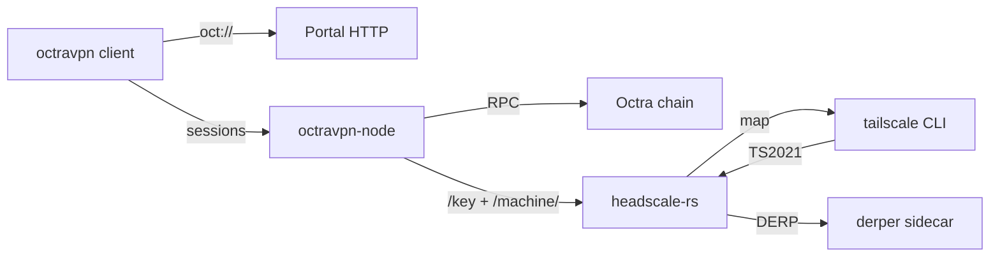

# OctraVPN demo runbook

A single source of truth for producing the OctraVPN demo recording. The
CLI segments are declared as VHS `.tape` files under `demo/tapes/` and
regenerate on a single command (`demo/run-demo.sh`); the browser
segments are captured by a human-with-OBS following the cues below.

The final cut is a 5-minute headline that proves "stock tailscale joins
our control plane, settles a paid session against a deployed contract,
and the operator can audit every byte after the fact." A 15-minute deep
dive expands each segment with the underlying technical material.

## Audience + length

- **Headline cut, 5 minutes** — Octra mainnet stakeholders, prospective
  operators, the "is this real" check. Punchy; visual; voiceover-led.
- **Deep dive, 15 minutes** — Technical reviewers (auditors, devs who
  might fork the protocol). Includes the audit replay, the on-chain
  hash-chain reconciliation, and the operator-side day-2 surface.

## Architecture (segment 0)

<!-- alt: Architecture graph. The OctraVPN client speaks oct:// to a
     Portal HTTP service and exchanges per-session calls with
     octravpn-node. The node makes Octra chain RPC calls, and speaks
     /key + /machine/ to a headscale-rs mesh. A stock tailscale CLI
     connects to the same mesh via TS2021; the mesh returns map data
     and forwards relayed traffic over a derper sidecar. -->


The diagram is the first card of the recording. Hold for 6 seconds
while the voiceover frames the demo.

## Cold open (15 s)

- Final 2 seconds of the `06-tailscale-interop.mp4` recording —
  specifically the "OK: tailscale interop succeeded" line and the
  `tailscale ping` round trip immediately above it.
- Voiceover (single sentence): "A stock Tailscale client just paid an
  operator on Octra to relay this ping."

## Segment 1: chain-side (1 min)

- Play `demo/recordings/05-v3-smoke.mp4`.
- Narration beats:
  1. "The contract handles register, settle, claim, slash..."
  2. "Each session is a hash-chained earnings record — the operator
     proves payout off-chain, then claims on-chain."
  3. "The overclaim attempt at step 8 is the demo of the bond's job."
- Fade to black on the "v3 smoke PASSED" banner.

## Segment 2: oct:// portal (1 min)

- **CLI half (split-screen left):** play
  `demo/recordings/02-portal-fetch.mp4`. Mute the gif — voiceover only.
- **Browser half (split-screen right):** human follows this:
  1. Open Chromium in a clean profile at `http://127.0.0.1:51823/`.
  2. Paste `oct://octCircleDemo/policy.json` into the URL entry box.
  3. Wait for the interstitial card; click "approve".
  4. Confirm the policy.json renders as pretty-printed JSON with the
     `Content-Type: application/json` chip visible.
- **OBS cue:** 1920x1080 region capture of the browser window only.
  60 fps. Mic recorded separately; mute system audio.

## Segment 3: web admin GUI (2 min)

- Open `http://127.0.0.1:51822/admin/`.
- Walk:
  1. Bearer-token login (paste the token shown in `octravpn-node` boot
     stdout).
  2. Dashboard: machines, users, preauthkeys.
  3. Create a user (`alice`), then a preauthkey for that user. Show
     the HMAC token UX + the per-circle confirm gate.
  4. Pivot to the machines panel; show one of the tsi-peer-{a,b}
     containers listed.
- **OBS cue:** browser-window region capture. Bring the dev tools panel
  in for a 5 s aside on the `/admin/preauth` POST so the viewer sees
  the same surface the CLI hits.

## Segment 4: observability (1 min)

- Open Grafana at `http://127.0.0.1:3000/d/octravpn`.
- Show, in order, with 10 s on each panel:
  1. Live session count (sparkline, last 5 min).
  2. Settlement rate (OU/sec, derived from the on-chain claim stream).
  3. DERP region distribution (so the viewer sees real packet flow).
- **OBS cue:** browser region capture. Hold the cursor still — Grafana
  has hover tooltips that can clutter the frame.

## Segment 5: Tailscale interop (1 min — headline payoff)

- Play `demo/recordings/06-tailscale-interop.mp4`.
- Voiceover beats:
  1. "Stock `tailscale` clients join our `headscale-rs` control plane."
  2. "Wire protocol: `/key`, controlbase Noise, flat `/machine/...`."
  3. "The relay is a `derper` sidecar that we built and ship — no
     Tailscale infrastructure dependency."
- Fade to a static card holding the diagram + the URL of this repo.

## Optional deep-dive segments (extras for the 15-min cut)

- **Segment 6: audit replay.** Play `demo/recordings/03-audit-replay.mp4`.
  Voiceover: HMAC-chained log, receipt-journal monotonicity, the verify
  exit code that an operator can wire into a cron healthcheck.
- **Segment 7: preauth surface.** Play
  `demo/recordings/04-mesh-preauth.mp4` next to a CLI session that
  pipes `mint-preauth` straight into `tailscale up`.
- **Segment 8: cold-start.** Play `demo/recordings/01-init-keygen.mp4`
  and `demo/recordings/07-headscale-cli.mp4` back to back: "from
  nothing to a working node + control plane in 90 seconds."

## Assembly (ffmpeg)

- Cross-fade between segments at 0.3 s.
- Mute the CLI VHS audio (silent recordings); voiceover layered in
  during OBS recording or in post.
- Concat the segments:
  ```sh
  ffmpeg \
      -i cold-open.mp4 \
      -i segment-1.mp4 \
      -i segment-2.mp4 \
      -i segment-3.mp4 \
      -i segment-4.mp4 \
      -i segment-5.mp4 \
      -filter_complex 'concat=n=6:v=1:a=1[v][a]' \
      -map '[v]' -map '[a]' \
      -c:v libx264 -preset slow -crf 18 \
      demo/recordings/octravpn-headline.mp4
  ```
- Target encode: 1080p, h.264, CRF 18, 5 min total.

## Appendix: capturing browser segments with OBS

- **Source:** Window Capture (not Display Capture) targeting the
  Chromium window only — keeps the system menu bar / dock out of the
  frame.
- **Canvas:** 1920x1080 at 60 fps.
- **Output:** mp4, libx264, CQ 18, mono mic audio. System audio MUTED
  so the gif soundtrack does not leak.
- **Cursor:** show, but slow it down — slam pans look worse than they
  read in a static doc.
- **Hotkeys:** bind start/stop to F8 so the operator's hand never
  appears on the recording.
- **Profile:** save a dedicated "OctraVPN demo" Chromium profile with
  the demo bookmarks pinned (`http://127.0.0.1:51823/`,
  `http://127.0.0.1:51822/admin/`, `http://127.0.0.1:3000/d/octravpn`).

## Captions

VHS does not emit a subtitle stream alongside its `.mp4` recordings. To
make the recordings accessible (and to give the embed-on-the-website
plan an explicit narrator track), every tape under `demo/tapes/<NN>.tape`
has a hand-authored sibling at `demo/recordings/<NN>.vtt`.

The `.vtt` files are strict WebVTT — they parse cleanly with
`webvtt-py`, `vtt.js`, Safari, Chromium, mpv, VLC, and ffmpeg's
`mov_text` subtitle muxer.

Two facts make captioning command-line recordings slightly tricky:

- **Display latency.** VHS animates each `Type "..."` block at the
  configured `TypingSpeed` (35-40 ms per character). A 60-character
  command takes ~2.5 s to appear on screen. The cue starts the moment
  the command begins typing — viewers see "what is happening" framed
  before they see the bytes.
- **What you type ≠ what you see ≠ what you hear.** A line like
  `bash docker/devnet/v3-smoke.sh` is one terminal command, one
  on-screen string, and one *intent* ("drive the full v3 contract
  lifecycle"). We caption the intent, not the keystrokes. The
  keystrokes are already on screen.

### Enabling captions in a viewer

- **`<video>` tag** (the website embed):
  ```html
  <video controls src="01-init-keygen.mp4">
    <track default kind="subtitles" srclang="en"
           src="01-init-keygen.vtt" label="English (narrator)">
  </video>
  ```
- **mpv:** `mpv --sub-file=01-init-keygen.vtt 01-init-keygen.mp4`
- **VLC:** drag the `.vtt` onto the playback window, or
  `Subtitle → Add Subtitle File…`.
- **QuickTime / Safari:** muxed-in `mov_text` tracks display
  automatically when the file is produced via
  `demo/lib/render-with-captions.sh` (see below).

### Muxing captions into the .mp4

The .vtt files travel as siblings, but for one-file distribution we
also produce a captioned variant:

```sh
demo/lib/render-with-captions.sh              # every tape
demo/lib/render-with-captions.sh 06-tailscale  # one substring filter
```

The script walks `demo/tapes/*.tape`, finds the matching `.mp4` + `.vtt`
in `demo/recordings/`, and produces `<NN>-captioned.mp4` with a
`mov_text` subtitle track embedded.

### Audio (TTS voiceover)

The same .vtt files double as a TTS script. `demo/lib/render-with-audio.sh`
synthesizes a narrator voice from the cue text, positions each cue's
audio at the cue's `start` timestamp, and muxes the result onto the
recording.

```sh
demo/lib/render-with-audio.sh              # every tape
demo/lib/render-with-audio.sh 06-tailscale  # one substring filter
OCTRA_TTS=espeak-ng demo/lib/render-with-audio.sh   # force backend
```

TTS backend selection:

- **macOS:** `/usr/bin/say` (preinstalled) — used by default.
- **Linux:** `espeak-ng` (`apt-get install -y espeak-ng`) — what CI
  uses.
- **Higher quality:** `piper` + a downloaded voice model
  (`PIPER_MODEL=/path/to/voice.onnx demo/lib/render-with-audio.sh`).
  Piper produces neural-network voiceovers that are nearly
  indistinguishable from a human narrator at 22 kHz mono.

When a `<NN>-captioned.mp4` already exists, the audio script writes
`<NN>-narrated-captioned.mp4` so the final file carries subtitles and
voiceover in a single artefact. When only the bare `.mp4` is present
the output is `<NN>-narrated.mp4`.

### Accessibility tradeoffs

Captioning command-line text is harder than captioning speech. We
caption the *intent* ("an operator deploys a fresh circle") rather
than the *keystrokes* ("octravpn init --dir ."). The keystrokes are
already on screen; reading them aloud would be redundant and would
push the caption density past the 1.5x comprehension threshold. The
tradeoff is that screen-reader users on a paused frame cannot
reconstruct the exact command from the caption alone — they would
need OCR or a transcript. For now we accept that gap; the .tape files
in `demo/tapes/` *are* the verbatim transcript.

## How to regenerate the CLI half

```sh
brew install vhs
./demo/run-demo.sh
```

The script re-renders every tape. Re-running with a substring filter
(`./demo/run-demo.sh 06-tailscale`) re-renders one tape — useful when
only the interop segment shifted.

The .tape files are the source of truth — never edit a gif/mp4
directly. If the CLI surface changes, update the .tape and re-render.

## Master tour (tapes 00 + 11..22)

A second tape series captures the end-to-end user + operator
experience as a single ~3-minute narrative cut, plus 12 stand-alone
companions covering each segment in depth.

| Tape | Theme | Job |
|------|-------|-----|
| `00-master-tour.tape` | fast-cut narrative (operator → owner → user → operator) | heavy |
| `11-user-install-linux.tape` | Linux apt install + `tailscale up` | light |
| `12-user-install-macos.tape` | macOS Homebrew + Tailscale.app | light |
| `13-user-ssh-peer.tape` | MagicDNS + `ssh peer-2` | light |
| `14-user-web-traffic.tape` | curl peer + `--exit-node` routing | light |
| `15-user-oct-url-public.tape` | portal serve + open-url; MIME shapes | light |
| `16-user-oct-url-sealed.tape` | sealed asset + CONFIRM + passphrase | light |
| `17-operator-onboarding.tape` | seal-keys → bond → register → run → health | heavy |
| `18-tailnet-owner-policy.tape` | `headscale policy set --file <FILE>` + live reload | heavy |
| `19-circle-update-atomic.tape` | atomic `circle update` (dry-run + commit) | heavy |
| `20-pvac-rotation.tape` | `rotate-pvac.sh` dry-run + broadcast + probe | heavy |
| `21-audit-verify.tape` | clean + tampered `audit verify` | heavy |
| `22-headscale-cli-tour.tape` | embedded `headscale` admin CLI tour | heavy |

Render the full series + stitch into one mp4:

```sh
brew install vhs ffmpeg
./demo/run-tour.sh                # render every tape + stitch
./demo/run-tour.sh --tapes        # render only; no stitch
./demo/run-tour.sh --stitch       # stitch existing recordings only
```

The script is idempotent — a tape with an mp4 newer than its `.tape`
source is skipped. The stitched output lands at
`demo/recordings/00-octravpn-tour.mp4` (concat of every available
recording in narrative order; missing mp4s are skipped with a
warning).

Light-job tapes (11..16) need only the `octravpn` / `octravpn-node`
binaries + stock `tailscale`. Heavy-job tapes (17..22 + the master
tour) need a reachable chain + a control-plane host; see each
tape's `# REQUIRES:` header for the per-tape state-dir contract.
