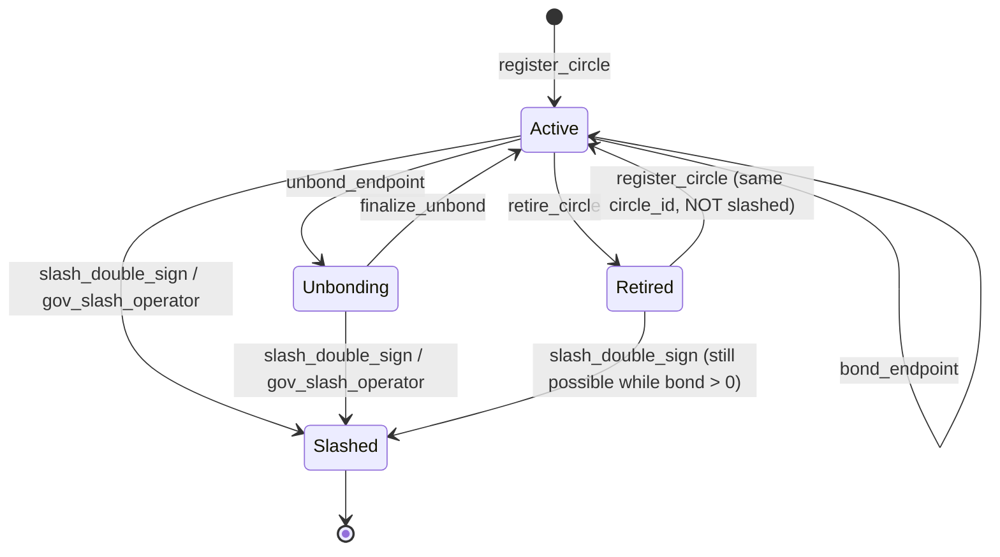
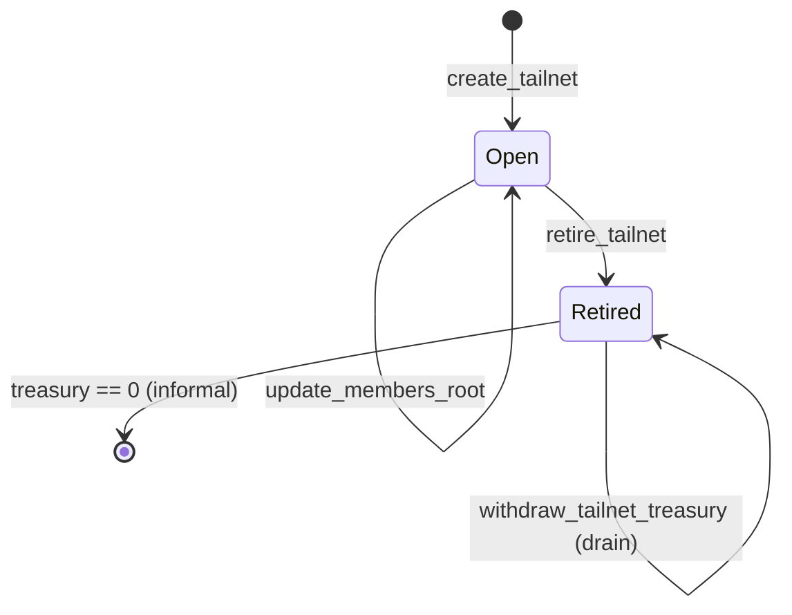
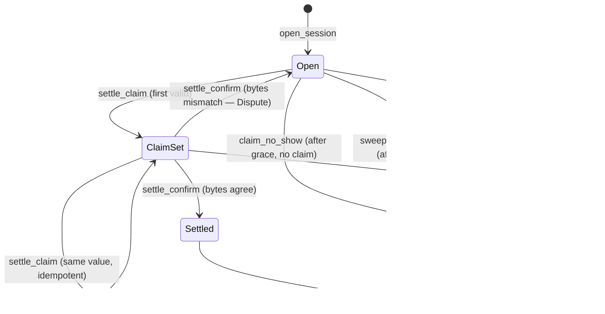

# v3 state machine

Formal FSM per stateful on-chain entity:
- [Circle](#circle) — registry + bond + slash;
- [Tailnet](#tailnet) — anchor + treasury;
- [Session](#session) — escrow + adjudication.

All state edges are anchored to entrypoints in
[`program/main-v3.aml`](../../program/main-v3.aml) and adversarial
cases in
[`docker/devnet/e2e-adversarial-v3.sh`](../../docker/devnet/e2e-adversarial-v3.sh).

## Circle

Composite state: a circle's record is `(active ∈ {0,1}, bond, unbonding,
unbond_unlock_epoch, slashed ∈ {0,1})`. The FSM above collapses
`bond>0 ∧ unbonding==0 ∧ active==1` into "Active",
`bond==0 ∧ unbonding>0 ∧ active==1` into "Unbonding",
`active==0 ∧ slashed==0` into "Retired", and `slashed==1` into the
terminal "Slashed".

### Transition table

| From       | Event                                | To         | Side effects                                                                 | Source                                                                  |
| ---------- | ------------------------------------ | ---------- | ---------------------------------------------------------------------------- | ----------------------------------------------------------------------- |
| _absent_   | `register_circle` (value ≥ min)      | Active     | bond, owner, receipt_pk, state_root, version=1, active=1, earnings_chain=sha256(state_root) | [`main-v3.aml:289-303`](../../program/main-v3.aml)                       |
| Active     | `update_circle_state`                | Active     | state_root, version++                                                        | [`main-v3.aml:320-322`](../../program/main-v3.aml)                       |
| Active     | `rotate_receipt_pubkey`              | Active     | receipt_pk                                                                   | [`main-v3.aml:335`](../../program/main-v3.aml)                           |
| Active     | `bond_endpoint` (value > 0)          | Active     | bond += value                                                                | [`main-v3.aml:358`](../../program/main-v3.aml)                           |
| Active     | `retire_circle`                      | Retired    | active=0; bond untouched                                                     | [`main-v3.aml:343`](../../program/main-v3.aml)                           |
| Retired    | `register_circle` (same circle_id)   | Active     | active=1, version=1 again                                                    | [`main-v3.aml:280-281`](../../program/main-v3.aml) — gated on `slashed==0` |
| Active     | `unbond_endpoint`                    | Unbonding  | unbonding=bond; bond=0; unlock_epoch=now+grace                               | [`main-v3.aml:370-372`](../../program/main-v3.aml)                       |
| Unbonding  | `finalize_unbond` (after grace)      | Active*    | unbonding=0; transfer; **bond stays 0 unless top-up** — operator typically retires | [`main-v3.aml:383-386`](../../program/main-v3.aml)                       |
| Active     | `slash_double_sign` (valid sigs)     | Slashed    | apply_slash: zero buckets; slashed=1; active=0; burn+bounty                  | [`main-v3.aml:194-215`](../../program/main-v3.aml)                       |
| Unbonding  | `slash_double_sign`                  | Slashed    | same as above; unbonding bond is included in `total`                         | [`main-v3.aml:198-202`](../../program/main-v3.aml)                       |
| any        | governance `gov_slash_operator`      | Slashed    | apply_slash (skips ed25519 check, owner-only)                                | [`main-v3.aml:406-412`](../../program/main-v3.aml)                       |
| Slashed    | _any_                                | Slashed    | All `register_circle`, `bond_endpoint`, `update_circle_state`, `rotate_*`, `settle_claim`, `claim_earnings` reject | [`main-v3.aml:281,318,333,355,490,651`](../../program/main-v3.aml) |

*Note on Unbonding → Active*: `finalize_unbond` does not directly
mark `active=0`. The circle remains `active=1` with `bond=0`. Most
operators retire after finalizing; otherwise their next
`open_session` against them still requires `circle_is_active` (which
is true) but is not economically sound — they have no slashable
stake. This is intentional: it preserves the option to re-bond.

### Edge cases

- **`register_circle` on a Retired circle**: legal. `circle_active`
  is 0 ([`main-v3.aml:280`](../../program/main-v3.aml) checks
  `circle_active == 0`); slashed is 0; existing bond + value must
  hit the floor. Earnings counters reset to 0 + 0; earnings chain
  resets to `sha256(state_root)`. **Open audit note**: this
  silently erases the prior earnings chain head, which an off-chain
  auditor expecting hash-chain continuity should detect.
- **Slash during Unbonding**: bond AND unbonding are both consumed
  ([`main-v3.aml:198-202`](../../program/main-v3.aml)). A grace
  window does NOT shelter you from slashing.
- **Equivocation slash uses receipt pubkey at slash-time**: if the
  operator rotated keys after the equivocating pair was signed,
  the on-chain `circle_receipt_pk` no longer verifies the older
  sigs, and `slash_double_sign` reverts. Off-chain attestation-
  history bots are the defense; see
  [`../security/threat-model-v3.md`](../security/threat-model-v3.md) §1.

## Tailnet

### Transition table

| From      | Event                                | To       | Side effects                                          | Source                                                            |
| --------- | ------------------------------------ | -------- | ----------------------------------------------------- | ----------------------------------------------------------------- |
| _absent_  | `create_tailnet` (value ≥ min)       | Open     | tid=count++, treasury=value, members_root, version=1  | [`main-v3.aml:424-431`](../../program/main-v3.aml)                 |
| Open      | `deposit_to_tailnet`                 | Open     | treasury += value                                     | [`main-v3.aml:441`](../../program/main-v3.aml)                     |
| Open      | `update_members_root`                | Open     | members_root, version++                               | [`main-v3.aml:452-453`](../../program/main-v3.aml)                 |
| Open      | `open_session` (any opener)          | Open     | treasury -= max_pay; session OPEN created             | [`main-v3.aml:497-506`](../../program/main-v3.aml)                 |
| Open      | session settled                      | Open     | treasury += refund (deposit - net)                    | [`main-v3.aml:584-586`](../../program/main-v3.aml)                 |
| Open      | session refunded (no-show/sweep/equiv)| Open    | treasury += refund (full / minus 1% bounty)            | [`main-v3.aml:614,635`](../../program/main-v3.aml)                  |
| Open      | `retire_tailnet`                     | Retired  | retired=1; treasury untouched                         | [`main-v3.aml:461`](../../program/main-v3.aml)                     |
| Retired   | `withdraw_tailnet_treasury`          | Retired  | treasury -= amount; transfer                          | [`main-v3.aml:472-473`](../../program/main-v3.aml)                 |
| Retired   | `open_session` / `deposit_*`         | reject   | revert `"tailnet retired"`                            | [`main-v3.aml:439,489`](../../program/main-v3.aml)                 |

### Edge case: tailnet retired while sessions OPEN

`retire_tailnet` does NOT close existing sessions. They remain OPEN
and continue to drain/refund into `tailnet_treasury`. Concretely:

1. Owner calls `retire_tailnet(tid)` — `tailnet_retired[tid] = 1`.
2. New `open_session` requests against `tid` revert.
3. Existing sessions can still `settle_claim` / `settle_confirm`
   (which do NOT consult `tailnet_retired`).
4. `withdraw_tailnet_treasury` would now drain mid-flight settlement
   funds. Defence: owners are expected to wait for all sessions to
   resolve (via grace + no-show / sweep / settle-confirm) before
   draining. No on-chain enforcement of this ordering — it's a
   runbook requirement.

## Session

The `ClaimSet` state is implicit: `session_status == OPEN ∧
operator_claim_set == 1`. The chain does not have a separate enum
value — composite check at
[`main-v3.aml:522-543`](../../program/main-v3.aml).

### Transition table

| From       | Event                                                          | To        | Side effects                                                                                 | Source                                                          |
| ---------- | -------------------------------------------------------------- | --------- | -------------------------------------------------------------------------------------------- | --------------------------------------------------------------- |
| _absent_   | `open_session`                                                 | Open      | sid=count++; deposit moves tailnet → session; opener/exit/tailnet/opened_at recorded         | [`main-v3.aml:497-506`](../../program/main-v3.aml)               |
| Open       | `settle_claim` (first call)                                    | ClaimSet  | operator_claim_set=1; operator_claim_bytes recorded                                          | [`main-v3.aml:539-541`](../../program/main-v3.aml)               |
| Open       | `claim_no_show` (after grace, never claimed)                   | Refunded  | tailnet_treasury += deposit; status=REFUNDED                                                 | [`main-v3.aml:611-614`](../../program/main-v3.aml)               |
| Open       | `sweep_expired_session` (after 10× grace)                      | Refunded  | bounty to caller; remainder → tailnet_treasury                                               | [`main-v3.aml:626-636`](../../program/main-v3.aml)               |
| ClaimSet   | `settle_claim` (same bytes)                                    | ClaimSet  | no-op (idempotent)                                                                           | [`main-v3.aml:525-527`](../../program/main-v3.aml)               |
| ClaimSet   | `settle_claim` (different bytes)                               | Refunded  | tailnet_treasury += deposit; status=REFUNDED; emit `SettleDispute` + `SessionRefunded`       | [`main-v3.aml:528-536`](../../program/main-v3.aml)               |
| ClaimSet   | `settle_confirm` (bytes mismatch)                              | Open      | client_confirm_set=1; emit `SettleDispute`; session stays OPEN                               | [`main-v3.aml:559-564`](../../program/main-v3.aml)               |
| ClaimSet   | `settle_confirm` (bytes agree)                                 | Settled   | cap net≤deposit; fee→treasury; refund→tailnet; earnings_total += net_after_fee; earnings_chain extended | [`main-v3.aml:566-599`](../../program/main-v3.aml) |
| Refunded   | _any_                                                          | Refunded  | All settle/confirm/sweep reject (`session not open`)                                         | [`main-v3.aml:516,552,606,622`](../../program/main-v3.aml)        |
| Settled    | _any_                                                          | Settled   | All settle/confirm/sweep reject                                                              | as above                                                        |

### Edge cases

- **Session under slash**: `slash_double_sign` against the exit
  circle does NOT auto-refund open sessions to that circle. The
  operator's `circle_active` flips to 0
  ([`main-v3.aml:208`](../../program/main-v3.aml)), so `settle_claim`
  now reverts with `"operator inactive"`
  ([`main-v3.aml:520`](../../program/main-v3.aml)). The session
  cannot settle. The opener's recovery: wait for `session_grace`,
  call `claim_no_show` (operator_claim_set is 0 → succeeds), OR
  wait for `10 × session_grace` and let anyone sweep for the 1%
  bounty. Adversarial coverage: E2 (open against already-slashed
  rejects), but mid-session slash is not directly drilled — it
  follows from the building blocks.
- **Dispute persistence**: a `SettleDispute` on `settle_confirm`
  does NOT change `session_status`. The session remains OPEN. The
  intended flow is that the off-chain dispute bot collects both
  signed receipts, identifies the equivocator, and submits
  `slash_double_sign`. Until then the OU is locked in the session
  escrow. After `10 × session_grace` anyone can sweep.
- **`settle_confirm` net > deposit**: capped at `deposit`
  ([`main-v3.aml:574-577`](../../program/main-v3.aml)). The
  operator credit can never exceed what the opener escrowed. This
  is the structural bound on overclaim.
- **`settle_confirm` net = 0**: legal. Status → SETTLED; full
  deposit refunded to tailnet; no earnings credit; hash chain NOT
  advanced (the `if net_after_fee > 0` gate at
  [`main-v3.aml:588`](../../program/main-v3.aml)).
- **`session_status` cannot regress**: REFUNDED and SETTLED both
  reject any further settle/confirm/sweep via the `session not
  open` guard. Once terminal, always terminal.

## Cross-entity invariants

These hold across multiple FSMs:

1. **OU conservation.** Across the lifetime of a session,
   `Δtreasury_tailnet + Δtreasury_program + Δbalance_operator +
   Δbalance_caller + burn_share == 0`. The program-treasury share
   is the fee
   ([`main-v3.aml:578-583`](../../program/main-v3.aml)); the
   operator share is the credit added to `circle_earnings_total`
   (claimable via `claim_earnings`); the caller share is the sweep
   bounty (if applicable); the burn share is `apply_slash`'s
   contribution
   ([`main-v3.aml:209-210`](../../program/main-v3.aml)).
2. **Slashed → no earnings**. `claim_earnings` rejects with
   `"operator slashed"`
   ([`main-v3.aml:651`](../../program/main-v3.aml)). A slashed
   operator's accumulated `circle_earnings_total` stays on chain
   forever as a permanent record but is unclaimable.
3. **Bond ⊃ slashable stake**. `apply_slash` sums BOTH
   `circle_bond` and `circle_unbonding`
   ([`main-v3.aml:198-200`](../../program/main-v3.aml)). There is
   no other field of slashable OU.
